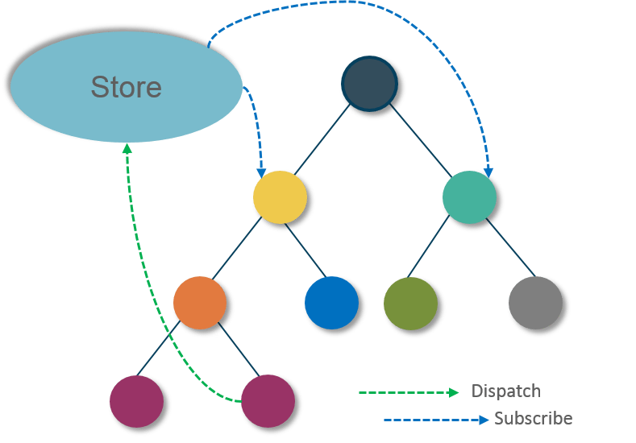

리덕스는 JS 앱을 위한 예측 가능한 상태 컨테이너입니다. 쉽게 설명하면 상태 관리의 로직을 컴포넌트 밖에서 처리합니다.

리덕스는 스토어라는 객체에 상태를 담아 상태 관리의 로직을 컴포넌트 밖에서 처리합니다.

리덕스 공식문서에서는 `Redux는 여러분이 일관적으로 동작하고, 서로 다른 환경(서버, 클라이언트, 네이티브)에서 작동하고, 테스트하기 쉬운 앱을 작성하도록 도와줍니다`라고 나와 있습니다.
<br />
<br />


예를들어, root노드의 좌측 자손 최하단의 노드(A)에서 오른쪽 자손 최하단 노드 (B)로 `state` 값을 전달하려고 하면 A에서 값을 부모로 전달하고, 루트에서는 다시 값을 내려주어야 하는데
이는 리액트로 작업하는 것을 아주 복잡하게 합니다. 이를 해결하기 위해, 상태를 더 편하게 관리하기 위해 `redux`가 등장하게 되었습니다.

리덕스를 사용하면 스토어에서 모든 상태 관리가 일어나며, 상태에 어떤 변화를 일으켜야 할 때 `action` 을 스토어에 전달해야 합니다.

`action`은 객체 형태로 되어 있으며, 상태를 변화시킬 때 이 액션을 참조하여 변화를 일으킵니다. 액션을 전달하는 과정은 `dispatch`라 합니다

스토어는 액션을 받으면 `reducer`가 전달받은 액션을 기반으로 상태를 어떻게 변경시켜야 할지 정하며, 액션을 처리하면 새 상태를 스토어에 저장합니다.

스토어 안에 있는 상태가 바뀌면 스토어를 `subscribe(구독)` 하는 컴포넌트에 바로 전달하며, 부모 컴포넌트로 `props`를 전달하는 작업은 생략하며 리덕스에 연결하는 함수를 사용하여 컴포넌트를 스토어에 구독시킵니다.

> 리덕스는 상태를 관리하기 좋은 도구이나 반드시 리덕스를 사용할 필요는 없습니다. 리덕스 공식문서 에서는 리덕스를 사용하기 위한 시점을 제시 해 두었는데, 
> 1. 시간에 따라 바퀴는 충분한 양의 데이터가 있고,
> 2. 상태를 위한 단 하나의 원천이 필요하며, 
> 3. 모든 상태를 가지고 있기에 최상위 상태는 더 이상 적절하지 않을 때 사용하라고 권고하고 있습니다.


## 1. Redux 구성 요소
* 스토어 : 애플리케이션의 상태 값들을 내장
* 액션 : 상태 변화를 일으킬 때 참조하는 객체
* 디스패치 : 액션을 스토어에 전달
* 리듀서 : 상태를 변화시키는 로직이 있는 함수
* 구독 : 스토어 값이 필요한 컴포넌트는 스토어를 구독

## 2. 설치
stable 버전을 설치하기 위해
```bash
yarn add redux react-redux
yarn add --dev redux-devtools

또는

npm install --save redux react-redux
npm install --save-dev redux-devtools
```

## 3. 요점
앱의 상태를 하나의 스토어(store)안에 있는 객체 트리에 저장되며, 상태 트리를 변경하는 유일한 방법은 액션을 보내는것(dispatch) 입니다. 그리고 액션이 상태 트리를 어떻게 변경할지 명시하기 위해 리듀서(reducer)를 작성해야 합니다.

추가적으로, Redux에는 3가지 원칙이 있는데
### 1. 하나의 어플리케이션에 하나의 스토어
### 2. 상태는 읽기전용
### 3. 리듀서는 순수한 함수여야 한다

## 4. 구성 요소
조금더 자세히 내부의 요소들을 살펴보면
### 1. 액션
액션은 스토어에서 상태 변화를 일으킬 때 참조하는 객체 이며, 이 객체는 `type` 값을 반드시 가지고 있어야 합니다. 이 액션의 `type`은 어떤 작업을 하는지 정의하며 일반적으로 대문자와 `_`의 조합으로 변수를 구성합니다.
```js
{
  type: "INCREMENT"
}

{
  type: 'INSERT_TODO',
  text: 'Learn React'
}

{
  type: 'INSERT_TODO',
  todo: {
    id: 1,
    text: 'Learn React',
    done: false
  }
}
```
위에서 보듯, type값은 고정이나 나머지 값들은 유동적입니다. 또한 우리가 상태를 변경시키기 위해서 액션을 새로 만들때마다 직접 객체를 만들어 주려고 하면 위의 내용들을 다 알고 있어야 하기 때문에 불편합니다.

그래서 보통 액션을 만들어주는 함수인 `action creator`를 만들어 줍니다(액션 생성 함수)

```js
const INCREMENT= "INCREMENT", DECREMENT="DECREMENT";

const increment = (diff) => ({
  type: INCREMENT,
  diff
});

const decrement = (diff) => ({
  type: DECREMENT,
  diff
})
```


## 참고자료
[Velopert](https://velopert.com/3528)

[Redux gitbook](https://lunit.gitbook.io/redux-in-korean/)

[리액트를 다루는 기술](http://www.yes24.com/Product/goods/62597469)