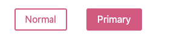
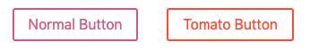

######

## 1. styled-components란?

React component system에서 CSS 스타일링을 더 효율적으로 하기 위해 등장하였습니다.
styled-components가 제공하는 것은
* <b>Automatic critical CSS</b>: styled-components는 자동으로 어떤 컴포넌트가 페이지에서 렌더 되는지 추적하고, 렌더되는 컴포넌트에 style을 주입합니다. code splitting과 결합아면, 이는 사용자가 필요한 최소한의 코드를 로드할 수 있습니다.


* <b>No class name bugs</b>: styled-component는 unique한 클래스 명을 만듭니다. 그래서 중복되거나 오버래핑 되거나, 클래스명 오타를 걱정 할 필요가 없습니다.


* <b>Easier deletion of CSS</b>:  클래스명이 어디에 사용됬는지 찾는것은 생각보다 어렵습니다. 그러나 styled-component는 이를 명백하게 해주고, 모든 styling된 것들은 특정 컴포넌트에 묶여있습니다. 만약 컴포넌트가 사용되지 않거나 지워진다면, 그 컴포넌트에 대한 모든 style 또한 지워지게 됩니다.


* <b>Simple dynamic styling</b>: 컴포넌트 기반의 props를 활용한 styling 또는 global theme을 활용하면 많은 클래스들을 직접 관리하며 스타일링 할 필요가 없습니다.
#
* <b>Painless maintenance</b>: 컴포넌트에 영향을 주는 스타일링을 찾으려고 이런 저런 파일들을 찾아다니며 돌아다니지 않아도 됩니다. 이는 코드가 아무리 길어지더라도 손쉽게 유지 보수 할 수 있게 합니다.

## 2. 설치
```bash
npm install --save styled-components
```
!>Babel plugin과 함께 사용하는걸 추천드립니다. 같이 사용하게 되면 더 많은 기능들을 사용할 수 있습니다.

## 3. 사용
### 1) Adapting based on props
styled-components에서 props를 활용하여 function으로 css를 조건부 할당 할 수 있습니다.
```js
const Button = styled.button`
  /* Adapt the colors based on primary prop */
  background: ${props => props.primary ? "palevioletred" : "white"};
  color: ${props => props.primary ? "white" : "palevioletred"};

  font-size: 1em;
  margin: 1em;
  padding: 0.25em 1em;
  border: 2px solid palevioletred;
  border-radius: 3px;
`;

render(
  <div>
    <Button>Normal</Button>
    <Button primary>Primary</Button>
  </div>
);
```
위 코드를 사용하면 아래와 같은 결과를 얻을 수 있습니다.


### 2) Extending Styles

Styled-components로 만든 Component를 overriding하여 사용 할 수 있습니다.
```js
const Button = styled.button`
  color: palevioletred;
  font-size: 1em;
  margin: 1em;
  padding: 0.25em 1em;
  border: 2px solid palevioletred;
  border-radius: 3px;
`;

// A new component based on Button, but with some override styles
const TomatoButton = styled(Button)`
  color: tomato;
  border-color: tomato;
`;
```
styled() 생성자로 만들어 놓은 컴포넌트를 상속하였고, 그 결과는 아래와 같습니다.


### 3) Define Styled Componenets outside of the render method

styled components는 렌더 밖에서 정의되어야 합니다. 그렇게 하지 않으면, 매 렌더시마다 재생산 되기 때문에 렌더가 느려지고 캐싱이 많이 되기 때문에 피하는 것이 좋습니다.