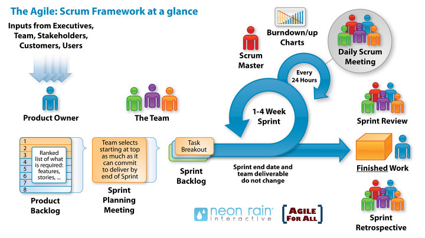

###### 2019.06.17

Project Owner

제품 책임자는 제품 백로그 관리와 팀이 수행하는 업무의 가치(Working software) 보장을 책임지는 유일한 사람으로 유저스토리를 담당한다.

개발 범위에 대한 책임자로써 제품 백로그의 개발 주체로서 작성, 변경에 대한 유일한 책임을 가지고 있다.

이 사람은 제품 백로그를 관리하고 이를 모든 사람들에게 가시화(burn down chart를 활용하여) 시킨다. <켄 슈와버>

즉, 요구사항을 관리하는 사람이면서 릴리즈 까지 담당한다.

!> burn up chart : user-story에 관련된 사항

