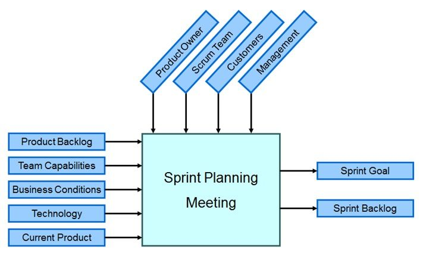

###### 2019.06.18

## 1. Scrum 이란?

* 애자일 방법론의 일종으로 짧은 시간 내에 최상의 비즈니스 가치를 제공하는데 초점을 둔 프로세스
* 실제 매 2주 혹은 4주마다 빠르고 반복적으로 실제 작동하는 소프트웨어를 제공하는 프로세스
* 비즈니스 쪼겡서는 우선순위를 정하고 개발팀은 최우선 순위의 기능을 가장 최적의 방법으로 제공하고자 하는 프로세스
* 매주 2주 혹은 4주마다 모든 사람이 실제로 작동하는 소프트웨어를 시연하고 다음 릴리스를 결정하는 프로세스

## 2. Scrum의 특징

* 자기 조직화된 팀으로 `Sprint`라고 불리는 2주 혹은 4주의 반복되는 개발 주기를 가진다.
* 요구사항의 아이템을 `제품 백로그`로 관리
* 특정한 엔지니어링 기법을 사용하라고 `강제하지 않음` => 이는 팀이 결정해서 작업한다. 이 때문에 애자일 팀에서 MSA(MicroSoft Architecture)를 만들어서 개발한다.
* `작동하는 소프트웨어의 개발`을 위한 애자일 환경을 만드는데 신경 써야 한다.

## 3. Scrum 참여자

### 1) 제품 책임자(Product Owner)

* 제품 기능 정의
* 릴리스 일정과 릴리스 시점의 기능 패키지 정의
* 제품의 ROI에 대한 책임
* 시장의 트렌드를 분석하여 기능의 우선순위 결정
* 매 스프린트별 기능을 수정하거나 우선순위 조정
* 소프트웨어 인수 혹은 거절

### 2) 스크럼 마스터(Scrum Master)

* 프로젝트에 대한 관리
* 스크럼의 가치와 실천 방법들의 수행 지원
* 소프트웨어 개발의 방해물 제거
* 팀이 지속적으로 협업하고 생산적인지 확인 및 지원
* 모든 역할과 기능이 밀접하게 협업하도록 지원
* 외부 방해요소로 팀원들을 보호하여 개발팀이 개발에 집중하도록 지원

### 3) 개발팀(Development Team)

* 일반적으로 5-10명
* 다기능 통합팀(QA, Programmer, UI Designer)
* 모든 팀원들은 모두 풀타임 근무자여야 한다
* 팀은 모두 자기 조직화가 되어야 한다
* 팀원들 개별 역할은 그 다음 스프린트에서 수정한다(필요시)

## 4. 회의

* 릴리스 계획 미팅
* 스프린트 계획 미팅
* 스프린트
* 일일 미팅( 일일 스크럼)
* 스프린트 검토 미팅
* 스프린트 회고

### 1) 릴리스 계획 미팅

프로젝트 전체저긍로 어떤 기능들을 묶어서 릴리스 할 것인지 계획하고, 이 계획에 따라 각 스프린트별로 백로그를 할당하는 것이 효율적이다.  
이런 계획을 제품 책임자와 같이 진행하고, 각 쪼개져 있는 요소들이 스프린트 백로그이다.

* 릴리스의 기준으로 시간, 비용, 기능이며 품질을 균일(동결)시켜야 한다.
* 릴리스는 빠르고 빈번해야 하며 이를 위해 릴리스 번다운차트를 작성하고 릴리스를 계획해야 한다.

### 2) 스프린트 계획 미팅

스크럼에서 스프린트는 2~ 4주의 주기를 가지고 있다. 개발 리듬을 유지하기 위해 일정한 주기가 좋다.  
스프린트 내에서 작동하는 소프트웨어가 완료되어야 하며 진행하는 동안 개발팀은 개발에 몰두 할 수 있어야 한다.  
각 스프린트는 일일 스크럼 회의를 진행한다.

### 3) 일일 회의(일일 스크럼 회의)

* 규칙 : 매일 15분정도, 일어서서
* 3가지 질문 : 어제 뭐했고, 오늘 뭐 할거고, 일하는데 방해가 되지 않는지
* 주의사항 : 문제를 의논하고 해결하는 회의가 아니라 누가 일정에서 뒤쳐져 있는지 확인하는 것이 아니다.
* 문제의 경우 회의가 끝나고 별도로 이야기 하는게 좋다(문제 당사자 + 해결 조력자)
* 전통적 방식으로 포스트잇을 이용하기도 하나, `트렐로`나 `레드마인`을 쓰는 것을 추천한다.

### 4) 스크린트 검토(리뷰) 회의

* 개발팀이 작성한 작동하는 소프트웨어를 고객에게 시연한다.  
* 새로운 기능에 대한 데모로써 2시간 정도라고 하지만 금방 끝날 수 있다.  
* 참석자는 고객, 관리자, 제품 책임자, 기타 엔지니어 등이 있다. 고객과 제품 책임자는 필수.

### 5) 스프린트 회고 미팅

*  스크럼 팀만 진행하며 스크럼 검토 회의에서 피드백 리뷰를 진행한다.
*  처음의 5-6번째 스프린트까지는 무조건 하는 것을 권장하며
*  3가지 질문 - 시작, 그만, 지속
* 상당히 가치있는 회의이다.
