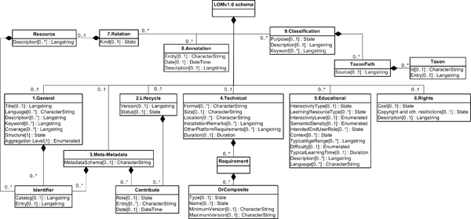
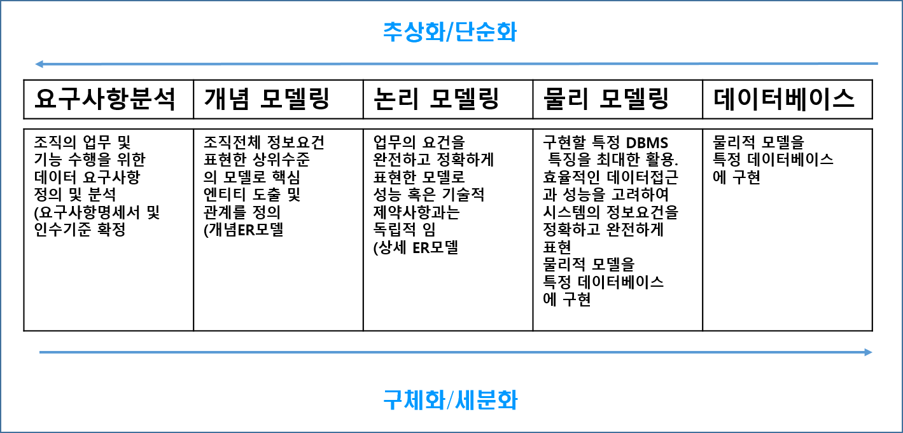
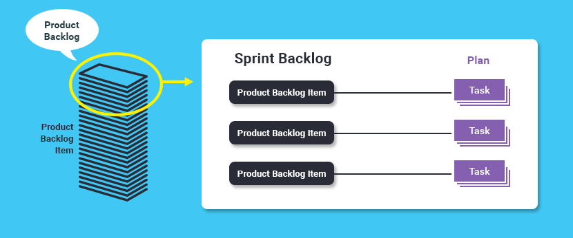
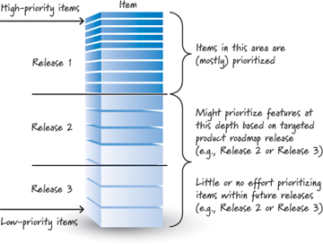
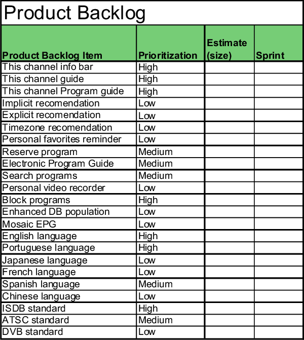

###### 2019.06.18

## 1. 요구사항 정의 방법

* 전통적 요구사항 정의
* 애자일 요구사항 정의 => 사용자 스토리를 중심으로
* 문서 및 표준(소스코드)이 잘 정의될 수록 역할간 협업이 수월하게 진행된다.

!> 애자일에서도 문서는 중요하다. 단지 과하고 중요하지 않은 문서를 지양하는 것이다.

### 1) UML(Unified Modeling Language)

* 모델링 표준으로써 구조 다이어그램 그룹과 행위 다이어그램 그룹으로 분류한다.
* 구조 다이어 그램은 시스템 요소를 정적 구조로 표현한다. 가령 시스템 아키텍처 구성, 시스템의 물리 요소, 시스템 실행 형상, 특정 도메인 업무 요소를 묘사할 수 있다.

### 2) 개념모델, 논리모델, 물리모델

시스템 모델은 개발을 진행하고 시간이 흐름에 따라 서로 다른 수준의 상세 수준으로 표현된다.

### 3) 제품 백로그와 스프린트 백로그의 차이

프로젝트팀, 제품책임자, 이해관계자가 모여서 이를 정한다.

### 4) 제품 백로그의 특성

* 적절한 수준에서 세부적으로 기술하며 제품 백로그 아이템은 추정의 결과이다.
* 자체적으로 진화하며 그 내용도 자주 변한다. 그러기에 제품 백로그의 모든 아이템에 우선순위를 조정하며 지속적으로 관리, 조정되어야 한다.
* 

### 5) 제품 백로그 산정방법

* 플레잉 포커, Man / Day 또는 Man / Month

### 6) 스프린트 백로그

* 제품 백로그 목록의 일부분으로 스프린트에서 해야 할 업무로 정의한다.
* 팀원들에 의해서 생성되며 각 아이템 별로 자체 상태값을 가져갈 수 있다.
* 매일 갱신될 수 있으며 하나의 목록에서 300개 이상의 목록은 추천하지 않으며
* 각 업무는 16시간 내로 하는 것이 적당하며 개발팀이 스프린트 백로그의 아이템을 넣고 뺄 수 있다. 

!> 이렇게 복잡하기에 별도의 엑셀 파일 또는 소프트웨어가 필요하다.

### 7) 번다운 차트

* 일별 전체적으로 스프린트 백로그의 남은 양을 표현
* 릴리스 하는데 추정되는 시간을 보여준다이상적으로 스프린트의 끝에서는 업무가 없어야 한다.
* 실제적으로 직선으로 그려지지 않는다.
* 번업(Burn Up)도 가능하다.

### 8) Time Boxing

일정 기간을 계쏙 반복하는 LifeCycle을 정의하는 것을 Time Boxing 이라 한다. 즉 시간을 제약한 것이다.  
반복, Time Boxing, Sprint 등은 모두 유사한 용도로 사용한다.

!> 반복은 애자일 일정 관리의 중심으로 전략과 릴리스의 내용을 구체화시키며 매일마다의 관리를 통한 결과물 작성을 위한 프로젝트 수행 단위이다.  

## 2. 비기능적 요소

애자일 프로젝트에서도 실제 프로젝트의 성공에 비기능 요건의 충족은 많은 영향을 준다.

제품 백로그, 스프린트 백로그에 비기능 관련 요건을 정의하고 이에 대한 구현 또는 충조깃키는 과정은 애자일 품질 관리에서 중요한 영역이다.

작게 나누어 프로젝트를 수행하는 다수의 애자일 프로젝트에서 아키텍처의 부재는 맹점으로 작용 할 수 있다.

### 1) 프로젝트 환경과 준비

* 이터레이션 제로 또는 초기 준비 단계에서는 각각의 경우 다른 접근이 필요하다
* 기존 환경을 그대로 활용하는 경우 별다른 준비요소가 필요하지 않을 수 있다.
* 새로운 개발 / 운영환경이 필요한 경우 초기 아키텍처 설계 및 지속적인 개선 정책이 필요하며 이에 대한 준비는 매우 중요한 요소로 작용한다.

### 2) 좋은팀

당연한 것.

### 3) 효율적인 산출물과 프로젝트

* 일반적으로 가장 효율적인 산출물 구성은 요구사항에 최적화된 `사용자 스토리`와 `소스코드` 이다.
* 중요한 것은 최적화된 만큼 품질과 활용에 대한 고려와 역량이 뒷받침 되어야 이들 산출물이 효율적인 산출물이 될 수 있다.
* 지나치게 산출물 관점에서만 효율화를 추구하는 경우 사소한 변경이나 추가 등의 작업에 매우 큰 비효율을 만들 수 있으므로 그 중간 적당선을 잘 고려해야 한다.
* 아주 작은 프로젝트가 아니라면 소스코드의 구조화가 전제되어야 하며 큰 프로젝트는 적절한 문서와 함께 지속적인 소스코드의 구조화가 필요하다.

?> UML을 활용한 문서 작성, 패턴을 이용한 소스코드 개선이 전체 프로젝트를 효율적으로 만들어 줄 수도 있을 뿐 아니라 프로젝트 성공에 기여 할 수 있다.

### 4) 소스코드

* 애자일 관점에서 동작하는 소프트웨어가 가장 중요하기 때문에 이를 위해 주기적으로 제시하며, 이 주기적인 제시를 위해 지속적인 통합이 필요하다. 그러므로 소스코드는 매우 중요하다.
* 처음부터 많은 것을 고려한 설계를 반영하기 어렵기 때문에 지속적 통합이 잘될 수 있는 소스코드를 만들기 위해 리팩토링이 필수적이다.
* 이를 위해 표준을 준수하며 리팩토링, 코드리뷰, pari coding 등으로 코드 품질을 유지해야 한다.
