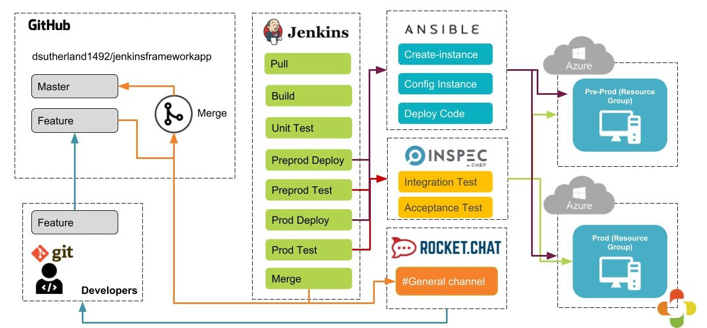
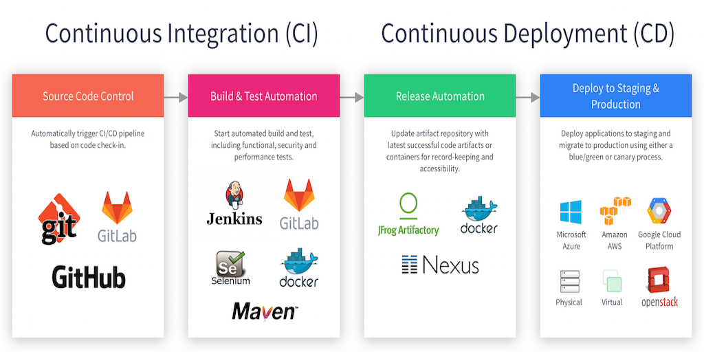

###### 2019.06.18

DevOps = Development + Operations  
소프트웨어 개발자들과 IT 종사자들 사이의 의사소통, 협업, 융합을 강조한 소프트웨어 개발 환경 혹은 문화

## 1. Continuous Integration(CI)

* 새롭게 만들어진 프로그램 코드를 릴리스해야 할 기존의 메인 프로그램과 빠르고 지속적으로 통합하는 단계
* Agile방법론 중 하나인 eXtreme Programming에 기반하고 있다.

> 모든 소스코드를 한곳으로 모은다  
> 의존 라이브러리 등의 경로가 연결된다  
> 필요한 경우 컴파일 한다  
> 데이터베이스 구축과 데이터 로드를 실시한다.  
> 필요에 따라 미들웨어를 설정하거나 가동한다.  
> 단위테스트와 통합 테스트, 사용자 테스트를 실시한다.  

* 버전관리 시스템 : git, subersion
* 빌드도구 :  Maven, Graddle
* 테스트코드 : Junit 
* CI 도구 : Travis CI, Jenkins

### 1) CI/CD
* CD는 CI의 확장 개념으로 사용되며 추가적으로 자동화 및 테스트를 통해 새롭게 만들어진 소스코드가 지속적인 배포가 되도록 준비하는 단계
* 조직에서 개발한 코드가 통합되어 자동으로 서비스 혹은 생상공정에 반영되는 단계

?> 애자일은 개발 방법론을 넘어선 일하는 방식의 패러다임이라고 보아야합니다.