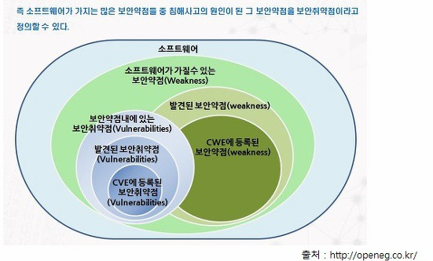

###### 2019.06.19

안전한 소프트웨어 개발을 위해 소스코드 등에 존재 할 수 있는 잠재적인 보안약점을 제거하고 
보안을 고려하여 기능을 설계, 구현하는 등 소프트웨어 개발 과정에서 일련의 보안활동을 수행하는 소프트웨어 개발 보안을 적용한다.

안전한 소프트웨어란 실류, 오류, 결함, 버그, 장애, 결점이 없는 소프트웨어를 말한다.

보안 약점(Weaknesses)  
* 소프트웨어에서 해킹 등 실제 보안 사고에 악용될 수 있는 보안 취약점의 근본 원인으로, 보안 약점은 버그다.

!> cwe.mitre.org 에서 발견된 보안약점을 파악하고, 이를 예방하기 위해 노력해야 한다. 여기서 발견된 보안 약점만 하더라도 천여개가 되는데 그중 가장 큰 영향을 주는 25가지만이라도 고려해야 한다.  
cve.mitre.org 보안 취약점을 파악할 수 있다.

보안 취약점(Vulnerabilities)  
* 소프트웨어 실행 시점에서 여러 개의 보안 약점 중 실제 침해 사고의 원인이 되는 그 보안 약점

대부분의 침해사고의 비중에서 15% 정도가 장비의 문제이고, 75 ~ 80% 정도가 어플리케이션 서버에서의 문제이다.  
이에 대한 일반론적 관점으로 프로그램이 버그가 있는 상태로 작동하게 되면 예외처리가 발생하게 되는데, 제대로 처리되지 않은 예외처리의 경우 프로그램이 종료가 되고, 만약 공격자가 의도하는 되로 작업이 된다면 이는 Vulnerability를 가지게 된다.

대부분의 공격은 사용자(공격자)가 조작할 수 있는 입력 또는 객체를 통해 공격이 수행된다. 즉 신뢰 되지 않는 외부 입력을 그대로 사용하는 것이 중요한 침해사고의 원인이 된다.  
그렇기에 개발자는 원하지 않는, 신뢰되지 않은 입력을 배제하는 보안과 관련된 작업을 수행 해야한다.

안전한 소프트웨어를 개발하기 위해 소스코드 등에 존재할 수 있는 잠재적인 보안약점을 제거하고 보안을 고려하여 기능을 설계, 구현하는 등 소프트웨어 개발과정에서 실행되는 일련의 보안활동을 시큐어 코딩이라 한다.  

!> 관리자 사이트는 인터넷으로 접속할 수 없고 로컬에서 접근할 수 있게 해야한다. 즉, port num을 80 또는 432를 사용하지 않는게 좋다.

OWASP를 참고하는 것도 좋다.

인증, 인가, 입력값 통제, 그리고 암호화와 로깅, 에러처리(Exception) 를 잘 하는게 개발자가 보안을 고려 할 때 가장 기본적이고, 핵심적인 요소가 된다.
